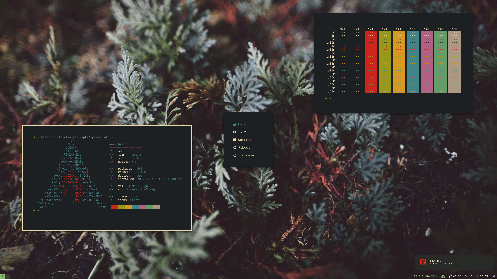

# Linux

- [user](./user): user dotfiles
- [pacman package lists](./pacman): package lists for arch
- [scripts](./scripts): assorted scripts for maintenance
- [bin](./bin): chmod +x
- [functions](./functions): shell fns
- [docs](./docs): notes
- colors: [gruvbox](https://github.com/morhetz/gruvbox) and [gruvbox-material](https://github.com/sainnhe/gruvbox-material-vscode)



### Setup

After creating symlinks with [dotbot](https://github.com/anishathalye/dotbot), this script will run `scripts/setup.sh` or `scripts/sync.sh` based on whether or not it's the first time this script has run. Configure `.env` to change how this script syncs environments.

```sh
./install
```
